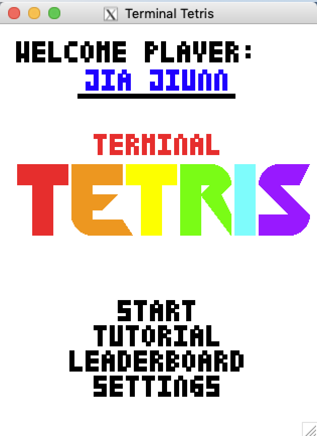
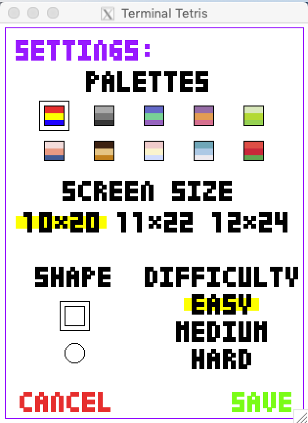
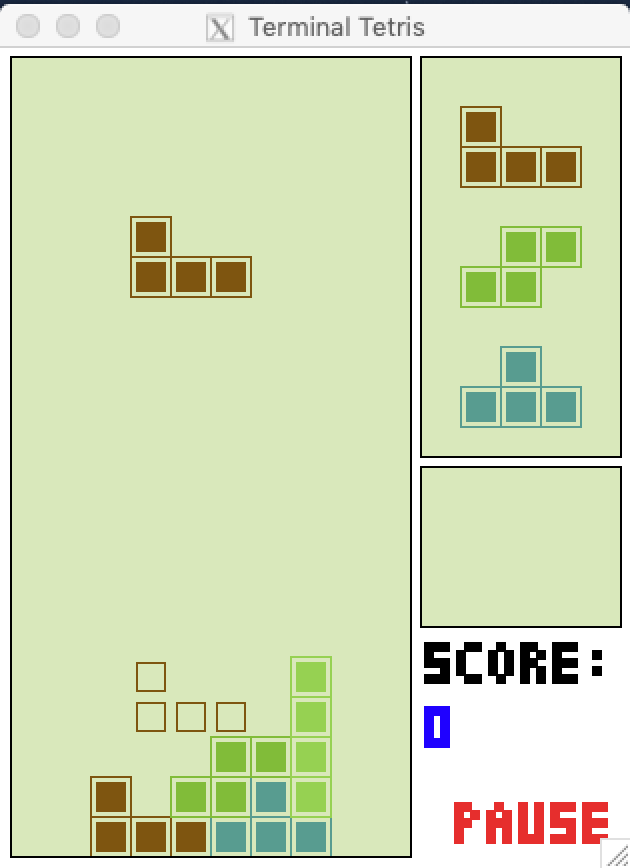
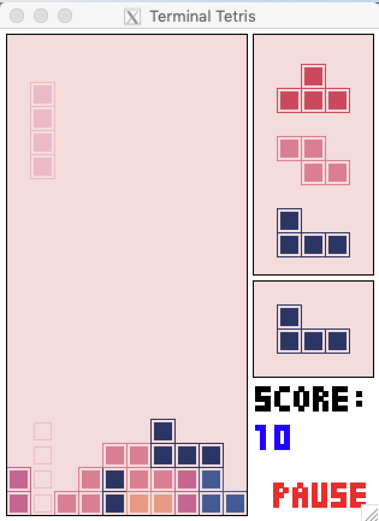

# tetris

An implementation of Tetris in OCaml, written with Xinquan Yang, Courtney Manbeck, and Jamie Lai for Cornell CS 3110’s final project. Our implementation supports different color themes, screen sizes, block shapes, and difficulty levels, as well as a leaderboard. Instructions for the controls, different features, and power-up blocks can be found in the tutorials menu. 

To play, clone this repo and run
```
make play
```

Here are some screenshots of the game screens:
<p align="center">
  &nbsp;&nbsp;&nbsp;&nbsp;&nbsp;
</p>
 
and gameplay:
<p align="center">
  &nbsp;&nbsp;&nbsp;&nbsp;&nbsp;
</p>